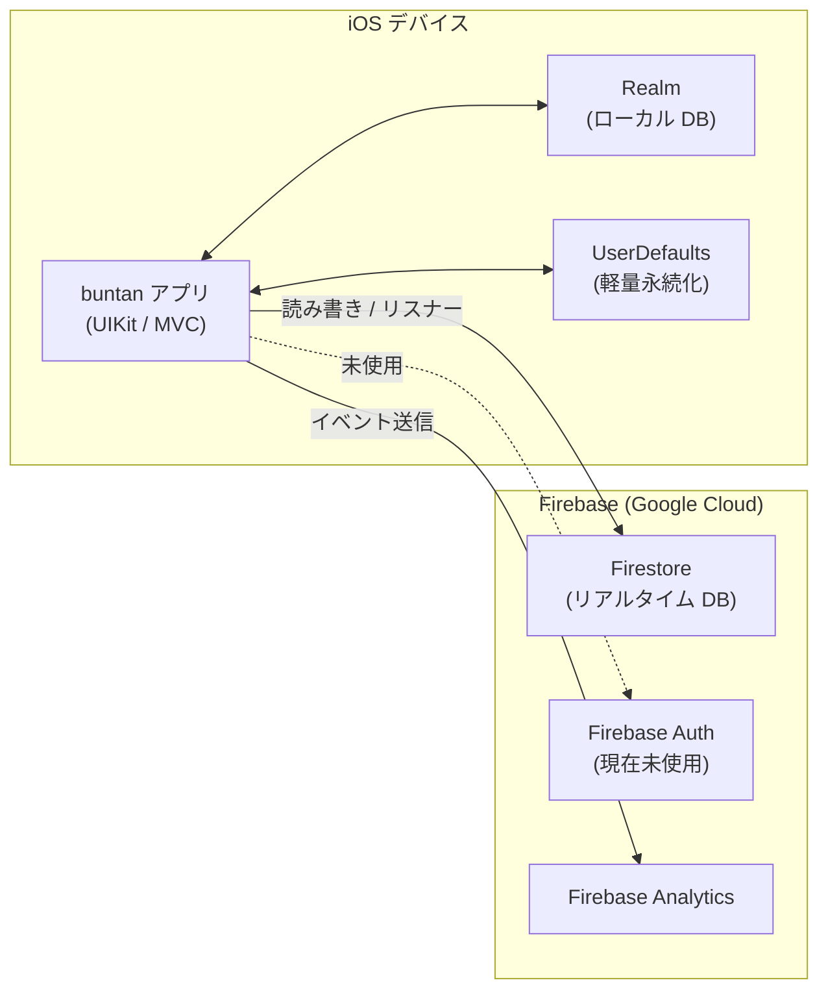

# アーキテクチャ定義書

## テクノロジースタック

| 項目 | 内容 |
|---|---|
| 言語 | Swift 5.0 |
| UI フレームワーク | UIKit（Storyboard + XIB） |
| 最小 iOS バージョン | iOS 13.0 |
| ターゲットデバイス | iPhone（`TARGETED_DEVICE_FAMILY = 1`） |
| バンドル ID | `com.naorandd.buntan` |
| アプリ表示名 | buntan - 家事分担アプリ |
| 現在のバージョン | 2.4（ビルド: 2.4.0） |
| パッケージ管理 | Swift Package Manager (SPM) |
| アーキテクチャパターン | MVC |

---

## 外部依存ライブラリ（SPM）

| ライブラリ | リポジトリ | バージョン指定 | 用途 |
|---|---|---|---|
| firebase-ios-sdk | github.com/firebase/firebase-ios-sdk | `>= 12.13.0`（upToNextMajor） | 認証・データベース・分析 |
| realm-swift | github.com/realm/realm-swift | `community` ブランチ | ローカル永続化 |
| XLPagerTabStrip | github.com/xmartlabs/XLPagerTabStrip | `>= 9.1.0`（upToNextMajor） | タブ付きフォーム UI |

### firebase-ios-sdk 使用プロダクト

| プロダクト | 用途 |
|---|---|
| FirebaseCore | SDK 初期化（`AppDelegate` で `FirebaseApp.configure()`） |
| FirebaseFirestore | グループ・タスク・ユーザーのリモート永続化 |
| FirebaseAuth | 認証（現在は動線なし・未使用） |
| FirebaseAnalytics | 利用状況分析 |

---

## システム構成図



---

## レイヤー構成

```
buntan/
├── AppDelegate.swift          起動処理・Firebase 初期化
├── SceneDelegate.swift        シーン管理
│
├── Model/                     データモデル（ドメイン層）
│   ├── TaskItem.swift         Realm Object（個人タスク履歴）
│   ├── GroupTask.swift        in-memory 構造体（グループタスク）
│   └── UserInfo.swift         in-memory 構造体（ユーザー情報）
│
├── Utils/                     データアクセス層（Singleton）
│   ├── RealmManager.swift     Realm CRUD・ポイント集計
│   └── FirebaseManager.swift  Firestore CRUD・リスナー管理
│
├── Controller/                プレゼンテーション層（ViewController）
│   └── *ViewController.swift  各画面（14クラス）
│
├── View/                      カスタムセル（UITableViewCell + XIB）
│   ├── TaskTableViewCell
│   ├── DashboardTableViewCell
│   ├── HistoryTableViewCell
│   └── MyTabBarController     UITabBarController + CustomTabBar
│
├── Animation/                 テーブルセルアニメーション
│   ├── TableViewAnimator.swift
│   └── Tables.swift           TableAnimation enum（4種類）
│
└── Contents/                  共通ユーティリティ
    ├── Contents.swift          Realm スキーマバージョン定数
    ├── ViewController+Extention.swift  showAlert ヘルパー
    └── MyUINavigationControllerViewController.swift  ナビバー外観設定
```

---

## データフロー

### グループタスクの同期

```
Firestore (task コレクション)
    │ addSnapshotListener
    ▼
FirebaseManager.setListener(completion:)
    │ フィルタリング（Group 一致）
    │ [GroupTask] にマッピング
    ▼
HomeViewController.groupTasks
    │ tableView.reloadData()
    ▼
TaskTableViewCell（表示）
```

### タスク完了フロー

```
HomeViewController（送信ボタン）
    │
    ├─► RealmManager.writeTaskItem   → Realm（TaskItem 保存）
    │
    └─► RealmManager.getTotalPoint   → 累計ポイント集計
            │
            ▼
        FirebaseManager.sendDoneTask → Firestore users ドキュメント上書き
```

### グループ切り替えフロー

```
ProfileViewController（グループ変更確定）
    │ UserDefaults.Group を更新
    │
    ▼
NotificationCenter.post(.notifyName)
    │
    ├─► HomeViewController.reloadScreen  → Realm 全削除 + リスナー再設定
    └─► DashboardViewController.reloadScreen → グループ名更新 + リスナー再設定
```

---

## 技術的制約

| 制約 | 詳細 |
|---|---|
| 最小 iOS | iOS 13.0 — `UIMenu`（コンテキストメニュー）が利用可能な最低バージョン |
| UI 方式 | Storyboard + XIB。ViewModel レイヤーや SwiftUI は使用しない |
| リアクティブ | Combine / RxSwift は使用しない。NotificationCenter でコンポーネント間通知 |
| 認証 | Firebase Auth は現在未使用。ユーザー識別は `UserDefaults` の文字列名のみ |
| オフライン | Realm によるローカル履歴参照のみ対応。タスク送信はネットワーク必須 |
| Lint | SwiftLint 未設定 |
| テスト | `buntanTests` ターゲットが存在するが、現時点でテストコードなし |

---

## パフォーマンス要件

| 項目 | 目標 |
|---|---|
| タスク一覧初期表示 | 通常ネットワーク環境で 3 秒以内 |
| ランキング更新 | Firestore リスナーによるリアルタイム更新（遅延 < 2 秒） |
| ローカル履歴読み込み | Realm 読み出しのため即時（< 100ms） |

---

## 注意事項・既知の設計上の決定

- `AppDelegate` でグローバル `print()` 関数をオーバーライドし、DEBUG ビルド以外での出力を抑制している
- Force-unwrap（`!`）が既存コード全体で多用されている（`UserDefaults` 読み出し・Storyboard キャスト等）。既存スタイルを踏襲し、新規コードでの追加は避ける
- `DashboardViewController` は `FirebaseManager` を経由せず Firestore を直接参照している（`FirebaseManager` の設計方針から外れている）
- Realm の `community` ブランチ固定は将来的なバージョン管理リスクがある
