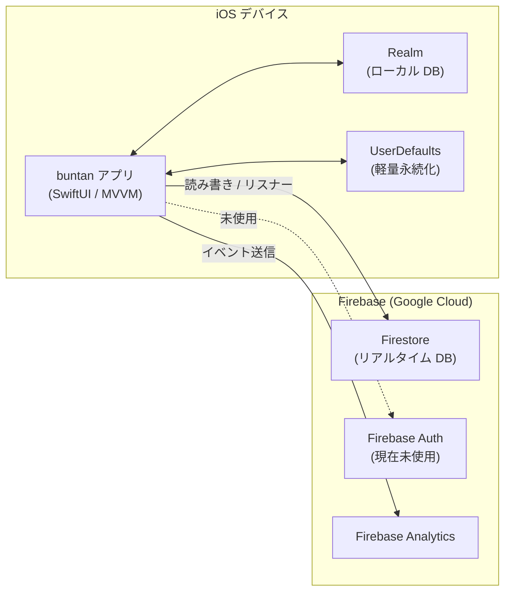

# アーキテクチャ定義書

## テクノロジースタック

| 項目 | 内容 |
|---|---|
| 言語 | Swift 5.0 |
| UI フレームワーク | SwiftUI（`@Observable` MVVM） |
| 最小 iOS バージョン | iOS 18.0 |
| ターゲットデバイス | iPhone（`TARGETED_DEVICE_FAMILY = 1`） |
| バンドル ID | `com.naorandd.buntan` |
| アプリ表示名 | buntan - 家事分担アプリ |
| 現在のバージョン | 2.4（ビルド: 2.4.0） |
| パッケージ管理 | Swift Package Manager (SPM) |
| アーキテクチャパターン | MVVM（`@Observable` マクロ） |

---

## 外部依存ライブラリ（SPM）

| ライブラリ | リポジトリ | バージョン指定 | 用途 |
|---|---|---|---|
| firebase-ios-sdk | github.com/firebase/firebase-ios-sdk | `>= 12.13.0`（upToNextMajor） | 認証・データベース・分析 |
| realm-swift | github.com/realm/realm-swift | `community` ブランチ | ローカル永続化 |

### firebase-ios-sdk 使用プロダクト

| プロダクト | 用途 |
|---|---|
| FirebaseCore | SDK 初期化（`AppDelegate` で `FirebaseApp.configure()`） |
| FirebaseFirestore | グループ・タスク・ユーザーのリモート永続化 |
| FirebaseAuth | 認証（現在は動線なし・未使用） |
| FirebaseAnalytics | 利用状況分析 |

---

## システム構成図



---

## レイヤー構成

```
buntan/
├── BuntanApp.swift            @main エントリーポイント
├── AppDelegate.swift          起動処理・Firebase 初期化
│
├── Model/                     データモデル（ドメイン層）
│   ├── TaskItem.swift         Realm Object（個人タスク履歴）
│   ├── GroupTask.swift        in-memory 構造体（グループタスク）
│   ├── UserInfo.swift         in-memory 構造体（ユーザー情報）
│   └── GroupDetail.swift      in-memory 構造体（グループ詳細）
│
├── Utils/                     データアクセス層（Singleton）
│   ├── RealmManager.swift     Realm CRUD・ポイント集計
│   └── FirebaseManager.swift  Firestore CRUD・リスナー管理
│
├── ViewModel/                 @Observable ViewModel（プレゼンテーション層）
│   ├── AppViewModel.swift     アプリ全体の状態（isSetup・currentUser・currentGroup）
│   ├── HomeViewModel.swift    グループタスク一覧・完了送信ロジック
│   ├── DashboardViewModel.swift  ランキングデータ管理
│   ├── ProfileViewModel.swift  ユーザー情報・グループ切り替え
│   ├── HistoryViewModel.swift  個人タスク履歴（Realm）
│   ├── AddTaskViewModel.swift  タスク追加フォーム
│   ├── AddGroupViewModel.swift グループ作成フォーム
│   ├── EditViewModel.swift    タスク編集フォーム
│   └── StartAppViewModel.swift 初回セットアップ
│
├── View/
│   ├── RootView.swift         isSetup で StartAppView / MainTabView を切り替え
│   ├── MainTabView.swift      TabView（Home / Dashboard）
│   ├── Components/            再利用可能な行コンポーネント
│   │   ├── TaskRowView.swift
│   │   ├── RankingRowView.swift
│   │   └── HistoryRowView.swift
│   └── Screens/               各画面 View
│       ├── StartAppView.swift
│       ├── HomeView.swift
│       ├── DashboardView.swift
│       ├── MenuView.swift
│       ├── ProfileView.swift
│       ├── HistoryView.swift
│       ├── AddAllView.swift
│       ├── AddTaskView.swift
│       ├── AddGroupView.swift
│       ├── EditView.swift
│       └── TutorialView.swift
│
└── Contents/                  共通ユーティリティ
    └── Contents.swift         Realm スキーマバージョン定数
```

---

## データフロー

### グループタスクの同期

```
Firestore (task コレクション)
    │ addSnapshotListener
    ▼
FirebaseManager.setListener(completion:)
    │ フィルタリング（Group 一致）
    │ [GroupTask] にマッピング
    ▼
HomeViewModel.groupTasks（@Observable）
    │ SwiftUI 自動再描画
    ▼
HomeView → List + TaskRowView（表示）
```

### タスク完了フロー

```
HomeView（送信ボタン）
    │
    ▼
HomeViewModel.sendTask(user:group:onSuccess:)
    │
    ├─► RealmManager.writeTaskItem   → Realm（TaskItem 保存）
    │
    └─► RealmManager.getTotalPoint   → 累計ポイント集計
            │
            ▼
        FirebaseManager.sendDoneTask → Firestore users ドキュメント上書き
```

### グループ切り替えフロー

```
ProfileView（グループ変更確定）
    │ AppViewModel.currentGroup を更新（didSet で UserDefaults 同期）
    │
    ▼
HomeView / DashboardView（.onChange(of: appVM.currentGroup)）
    │
    ├─► HomeViewModel.onGroupChanged   → Realm 全削除 + リスナー再設定
    └─► DashboardViewModel.onGroupChanged → リスナー解除 + 再設定
```

---

## 技術的制約

| 制約 | 詳細 |
|---|---|
| 最小 iOS | iOS 18.0 — `@Observable`、`NavigationStack`、`.onChange(of:)` (2引数版) 等の最新 SwiftUI API を制限なく使用 |
| UI 方式 | SwiftUI（MVVM）。Storyboard / XIB は廃止済み |
| リアクティブ | `@Observable` マクロを使用。`NotificationCenter` によるリロードトリガーは ViewModel に置き換え済み |
| 認証 | Firebase Auth は現在未使用。ユーザー識別は `UserDefaults` の文字列名のみ |
| オフライン | Realm によるローカル履歴参照のみ対応。タスク送信はネットワーク必須 |
| Lint | SwiftLint 未設定 |
| テスト | `buntanTests` ターゲットが存在するが、現時点でテストコードなし |

---

## パフォーマンス要件

| 項目 | 目標 |
|---|---|
| タスク一覧初期表示 | 通常ネットワーク環境で 3 秒以内 |
| ランキング更新 | Firestore リスナーによるリアルタイム更新（遅延 < 2 秒） |
| ローカル履歴読み込み | Realm 読み出しのため即時（< 100ms） |

---

## 注意事項・既知の設計上の決定

- `AppDelegate` でグローバル `print()` 関数をオーバーライドし、DEBUG ビルド以外での出力を抑制している
- `AppViewModel` はアプリ全体の状態を `@Observable` で管理し、`.environment(appVM)` 経由で全 View に渡す。`currentGroup` の変更は `didSet` で即 `UserDefaults` へ同期する
- Force-unwrap（`!`）が `UserDefaults` 読み出し周りで残存している。既存スタイルを踏襲し、新規コードでの追加は避ける
- Realm の `community` ブランチ固定は将来的なバージョン管理リスクがある
- `AccentColor.colorset` に `#F79321`（オレンジ）を設定済み。SwiftUI の全コントロール（タブバー・ボタン・トグル等）に自動適用される
