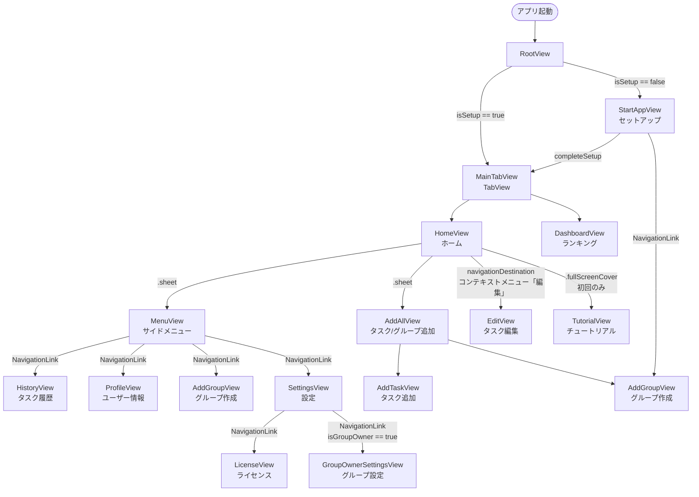

# 機能設計書

## アーキテクチャ概要

MVVM パターン（`@Observable` マクロ）。View は `@Observable` な ViewModel を観察し、SwiftUI が差分を自動再描画する。データアクセスは2つのシングルトンマネージャに委譲する。

```
View (@Environment / @State)
    └── ViewModel (@Observable)
            ├── RealmManager.shared   ← ローカル永続化（個人タスク履歴）
            └── FirebaseManager.shared ← Firestore 読み書き + リアルタイムリスナー
```

| コンポーネント | 役割 |
|---|---|
| `AppViewModel` | アプリ全体の状態（`isSetup`・`currentUser`・`currentGroup`・`currentGroupOwner`・`fontSizeIndex`）。UserDefaults と同期し `.environment()` で全 View に注入。グループ削除リスナー（`groupDeletionListener`）も管理する |
| `RealmManager.shared` | `TaskItem` の CRUD・累計ポイント集計 |
| `FirebaseManager.shared` | Firestore への読み書き・スナップショットリスナー管理 |
| `UserDefaults` | セットアップ状態・ユーザー名・グループ名の永続化 |

グループ変更の検知は View 側の `.onChange(of: appVM.currentGroup)` で行う。`NotificationCenter` は使わない。

---

## データモデル

### Realm — `TaskItem`（個人タスク履歴）

```
TaskItem
├── taskId : String  (primaryKey, UUID)
├── name   : String  (タスク名)
├── point  : Int     (ポイント)
└── time   : String  (完了日時 yyyyMMddHHmmss)
```

Realm スキーマバージョンは `buntan/Contents/Contents.swift` の `CurrentSchemaVersion`（現在: `1`）で管理。

### in-memory — `GroupDetail`

```
GroupDetail
├── name        : String  (グループ名)
├── isPassword  : Bool    (パスワード有無)
├── password    : String  (パスワード文字列)
├── owner       : String  (作成者ユーザー名)
└── displayName : String  (computed: パスワード付きは "🔓　グループ名")
```

### Firestore コレクション

| コレクション | ドキュメントID | フィールド | 用途 |
|---|---|---|---|
| `task` | 自動採番 | `group: String`, `name: String`, `point: Int` | グループ共有タスク一覧 |
| `group` | グループ名（一意） | `name: String`, `isPassword: Bool`, `password: String`, `owner: String` | グループ定義 |
| `users` | ユーザー名 | `name: String`, `group: String`, `point: Int` | ユーザー累計ポイント |

### UserDefaults キー一覧

| キー | 型 | 用途 |
|---|---|---|
| `User` | String | ユーザー表示名 |
| `Group` | String | 参加中のグループ名 |
| `isSetup` | Bool | 初回セットアップ完了フラグ |
| `isShowTutorial` | Bool | チュートリアル表示済みフラグ |
| `fontSizeIndex` | Int | フォントサイズ選択インデックス（0〜6、デフォルト: 3 =「標準」） |

---

## 画面一覧

| View | 画面名 | 概要 | 提示方法 |
|---|---|---|---|
| `StartAppView` | セットアップ | 初回起動時にユーザー名・グループを設定する | `RootView` から直接（フルスクリーン） |
| `MainTabView` | タブバー | ホーム・ダッシュボードを管理するルートコンテナ | `RootView` から直接（フルスクリーン） |
| `HomeView` | ホーム | グループタスク一覧・タスク完了送信 | Tab 1 の `NavigationStack` ルート |
| `DashboardView` | ランキング | グループ内ポイントランキング（リアルタイム） | Tab 2 の `NavigationStack` ルート |
| `MenuView` | サイドメニュー | ユーザー名・累計ポイント表示・各画面へのナビゲーション | `.sheet` |
| `ProfileView` | ユーザー情報 | ユーザー名編集・グループ切り替え | `MenuView` から `NavigationLink` |
| `HistoryView` | タスク履歴 | 個人タスク完了履歴（Realm） | `MenuView` から `NavigationLink` |
| `AddAllView` | 追加（コンテナ） | タスク追加・グループ作成のセグメント切り替えコンテナ | `.sheet` |
| `AddTaskView` | タスク追加 | グループ共有タスクを Firestore に追加 | `AddAllView` 内（セグメント Tab 0） |
| `AddGroupView` | グループ作成 | Firestore にグループを作成 | `AddAllView` 内（セグメント Tab 1） |
| `EditView` | タスク編集 | グループ共有タスクを Firestore 上で編集 | `navigationDestination` でプッシュ |
| `TutorialView` | チュートリアル | 初回起動後の +ボタン スポットライト案内 | `.fullScreenCover` |
| `SettingsView` | 設定 | フォントサイズ調整・ライセンス表示・グループ退会/削除 | `MenuView` から `NavigationLink` |
| `LicenseView` | ライセンス | OSS ライセンス一覧 | `SettingsView` から `NavigationLink` |
| `GroupOwnerSettingsView` | グループ設定 | グループ名変更・パスワード変更（オーナーのみ） | `SettingsView` から `NavigationLink` |

---

## 画面遷移図



---

## 機能詳細

### 1. 初回セットアップ（`StartAppView`）

- 起動時 `RootView` が `appVM.isSetup` を確認。`true` なら即 `MainTabView` を表示
- 未設定の場合：
  1. ユーザー名をテキストフィールドで入力（`vm.userName`）
  2. `vm.fetchGroups()` で Firestore `group` コレクションからグループ一覧を取得してウィールピッカーに表示
  3. `NavigationLink("グループを新規作成")` で `AddGroupView` へ遷移してグループを作成することも可能
  4. 「はじめる」ボタン押下で `vm.completeSetup(appVM:)` を呼び出し
     - `appVM.currentUser`・`appVM.currentGroup` を更新（`UserDefaults` へ即時同期）
     - `FirebaseManager.setupUser` で Firestore `users` ドキュメントを作成（`merge: true`）
     - `appVM.isSetup = true` にして `MainTabView` へ切り替え

### 2. グループタスク一覧・タスク完了（`HomeView`）

- `.onAppear` で `homeVM.setListener(group:)` を呼び、Firestore スナップショットリスナーを設定
- リスナーは `task` コレクションを監視し、現在の `Group` に一致するタスクのみ `homeVM.groupTasks` にマップして自動再描画
- タスク選択 → `homeVM.selectedTask` を更新。選択タスクは `Color.accentColor`（#F79321）でハイライト
- 「送信」ボタン押下時（`homeVM.sendTask`）：
  1. `RealmManager.writeTaskItem` でローカル履歴に保存
  2. `RealmManager.getTotalPoint` で累計ポイントを集計
  3. `FirebaseManager.sendDoneTask` で Firestore `users` ドキュメントを上書き
- コンテキストメニューから編集（`EditView` へプッシュ）・削除が可能
- `appVM.currentGroup` の変化を `.onChange` で検知し `homeVM.onGroupChanged` を呼び出す

### 3. ランキング（`DashboardView`）

- `.onAppear` で `dashboardVM.setListener(group:)` を呼び、Firestore `users` コレクションにリアルタイムリスナーを設定
- 現在の `Group` に一致するユーザーを `point` 降順でソートして `RankingRowView` で表示
- `appVM.currentGroup` の変化を `.onChange` で検知し `dashboardVM.onGroupChanged` を呼び出す

### 4. サイドメニュー（`MenuView`）

- `HomeView` のツールバー左ボタンから `.sheet` で表示
- ユーザー名（`AppViewModel.currentUser`）と累計ポイント（`RealmManager.getTotalPoint()`）をヘッダーに表示
- 「メニュー」セクション：
  - `NavigationLink("タスク履歴")` → `HistoryView`
  - `NavigationLink("ユーザー情報")` → `ProfileView`
  - `NavigationLink("グループ作成")` → `AddGroupView`
- 「設定」セクション：
  - `NavigationLink("設定")` → `SettingsView`
- 閉じるボタンで dismiss

### 5. ユーザー情報・グループ切り替え（`ProfileView`）

- ユーザー名：テキストフィールドで編集し「保存」ボタンで `appVM.currentUser` を更新
- グループ変更フロー：
  1. ウィールピッカーで選択
  2. パスワード付きグループの場合 → `.alert` で SecureField を表示してパスワード照合
  3. 確認アラート表示
  4. 承認後：`appVM.currentGroup` を更新 → `.onChange` 経由で HomeView / DashboardView のリスナーが自動更新

### 6. タスク履歴（`HistoryView`）

- `.onAppear` で `historyVM.fetchHistory()` を呼び、全 `TaskItem` を取得して表示
- 編集モードでスワイプ削除時：`RealmManager.deleteTaskItem` で Realm から削除し、`FirebaseManager.sendDoneTask` で Firestore `users` の累計ポイントを再集計して更新する

### 7. タスク追加（`AddTaskView`）

- タスク名・ポイントを入力して「作成」ボタン押下
- `AddTaskViewModel.addTask(group:)` → `FirebaseManager.addTask` で現在の `Group` に紐づけて Firestore `task` コレクションに追加

### 8. グループ作成（`AddGroupView`）

- グループ名を入力。`usePassword` トグルを ON にすると追加の SecureField を表示
- バリデーション（`AddGroupViewModel.addGroup()` が `ValidationError` をスロー）：
  - `noGroupName`：グループ名が空
  - `noPassword`：パスワードが空
  - `invalidPassword`：半角英数字5文字未満
- `FirebaseManager.addGroup` で Firestore `group` コレクションにドキュメントを作成

### 9. タスク編集（`EditView`）

- `HomeView` のコンテキストメニュー「編集」から `navigationDestination` でプッシュ
- `EditViewModel(task:)` のイニシャライザで初期値（タスク名・ポイント）をセット
- 「保存」押下で `EditViewModel.save(group:)` → `FirebaseManager.editDocument`（トランザクション更新）

### 10. チュートリアル（`TutorialView`）

- `HomeView.onAppear` で `appVM.isShowTutorial` が `false` の場合、0.5秒の `Task.sleep` 遅延後に `.fullScreenCover` で表示（直後表示によるレイアウト崩れ防止のため）
- スポットライト形状で +ボタンの位置をハイライト、「+ボタンからタスクを追加してみましょう！」をツールチップで案内
- 画面タップで dismiss し `appVM.isShowTutorial = true` を保存

### 11. 設定（`SettingsView`）

- `MenuView` の「設定」セクションから `NavigationLink` で遷移
- **フォントサイズ調整：** `Slider` で `AppViewModel.fontSizes`（7段階: 小〜最大(2倍)）を選択。変更は即時 `appVM.fontSizeIndex` に反映され `UserDefaults` へ同期。アプリ全体の `dynamicTypeSize` が更新される
- **ライセンス：** `NavigationLink("ライセンス")` で `LicenseView` へ遷移し OSS ライセンスを表示
- **グループ設定（オーナーのみ）：** `appVM.isGroupOwner == true` の場合のみ「グループ名・パスワードを変更」セクションを表示し、`GroupOwnerSettingsView` へ遷移
- **グループ管理：**
  - 「グループを退会する」→ 確認アラート → `appVM.leaveGroup()` を呼び出し、Realm 全データ削除・UserDefaults リセット・Firestore `users` からドキュメント削除 → 初期セットアップ画面へ遷移
  - 「グループを削除する」（オーナーのみ）→ 確認アラート → `appVM.deleteGroup(groupName:)` を呼び出し、グループタスク全削除・グループドキュメント削除 → 全メンバーの削除リスナーが発火し初期セットアップ画面へ強制遷移

### 12. グループオーナー設定（`GroupOwnerSettingsView`）

- `SettingsView` の「グループ設定」セクション（`appVM.isGroupOwner == true` の場合のみ表示）から遷移
- **グループ名変更：** 新しいグループ名を入力して「名前を変更する」→ 確認アラート → `appVM.renameGroup(to:)` → `FirebaseManager.renameGroup(oldName:newName:owner:)` で Firestore を更新
- **パスワード設定：** トグルでパスワード有効/無効を切り替え。有効時は `SecureField` で入力（半角英数字5文字以上）。「パスワードを保存する」で `FirebaseManager.updateGroupPassword(name:isPassword:password:)` を呼び出し

---

## UI パターン

| パターン | 実装 |
|---|---|
| タブバー | `TabView` + `tabItem` でネイティブ実装 |
| タブ付きフォーム | `AddAllView` で `Picker(.segmented)` + 条件分岐による View 切り替え |
| アラート | `.alert` modifier（`isPresented: Binding<Bool>`）で統一。`UIAlertController` は使わない |
| 行コンポーネント | `TaskRowView`・`RankingRowView`・`HistoryRowView`（`Components/` に配置） |
| スポットライト | `TutorialView` 内の `SpotlightShape`（even-odd fill）と `ClearBackground` で実現 |
| アクセントカラー | `AccentColor.colorset` に `#F79321`（オレンジ）を設定。タブ・ボタン・選択ハイライトに自動適用 |
| ハプティクスフィードバック | `.sensoryFeedback` modifier（iOS 17+ API）を使用。タブ切り替え時 `.selection`、メニューシート表示時 `.impact(weight: .light)`、タスク送信完了時 `.success` |
| フォントサイズ | `AppViewModel.dynamicTypeSize` を `.environment(\.dynamicTypeSize, appVM.dynamicTypeSize)` でアプリ全体に適用。7段階（`.medium` 〜 `.accessibility2`）を `SettingsView` で調整可能 |
