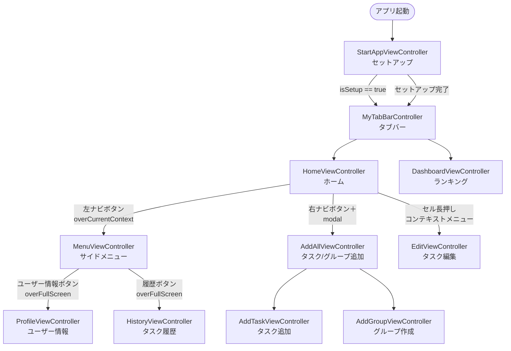

# 機能設計書

## アーキテクチャ概要

MVC パターン。ViewController がデータアクセスをすべて2つのシングルトンマネージャに委譲する。

```
ViewController
    ├── RealmManager.shared   ← ローカル永続化（個人タスク履歴）
    └── FirebaseManager.shared ← Firestore 読み書き + リアルタイムリスナー
                                  ↓ NotificationCenter.post(.notifyName)
                              ViewController（UI 更新）
```

| コンポーネント | 役割 |
|---|---|
| `RealmManager.shared` | `TaskItem` の CRUD・累計ポイント集計 |
| `FirebaseManager.shared` | Firestore への読み書き・スナップショットリスナー管理 |
| `UserDefaults` | ログイン状態・セットアップ状態・ユーザー名・グループ名の永続化 |
| `NotificationCenter (.notifyName)` | グループ変更時に全画面へ一括通知してリロードをトリガーする |

---

## データモデル

### Realm — `TaskItem`（個人タスク履歴）

```
TaskItem
├── taskId : String  (primaryKey, UUID)
├── name   : String  (タスク名)
├── point  : Int     (ポイント)
└── time   : String  (完了日時 yyyyMMddHHmmss)
```

Realm スキーマバージョンは `buntan/Contents/Contents.swift` の `CurrentSchemaVersion`（現在: `1`）で管理。

### Firestore コレクション

| コレクション | ドキュメントID | フィールド | 用途 |
|---|---|---|---|
| `task` | 自動採番 | `group: String`, `name: String`, `point: Int` | グループ共有タスク一覧 |
| `group` | グループ名（一意） | `name: String`, `isPassword: Bool`, `password: String` | グループ定義 |
| `users` | ユーザー名 | `name: String`, `group: String`, `point: Int` | ユーザー累計ポイント |

### UserDefaults キー一覧

| キー | 型 | 用途 |
|---|---|---|
| `User` | String | ユーザー表示名 |
| `Group` | String | 参加中のグループ名 |
| `isSetup` | Bool | 初回セットアップ完了フラグ |
| `isShowTutorial` | Bool | チュートリアル表示済みフラグ |
| `isLogin` | Bool | ログイン済みフラグ（現在未使用） |
| `isSignup` | Bool | サインアップ済みフラグ（現在未使用） |

---

## 画面一覧

| 画面クラス | 画面名 | 概要 |
|---|---|---|
| `StartAppViewController` | セットアップ | 初回起動時にユーザー名・グループを設定する |
| `MyTabBarController` | タブバー | ホーム・ダッシュボードを管理するルートコンテナ |
| `HomeViewController` | ホーム | グループタスク一覧・タスク完了送信 |
| `DashboardViewController` | ランキング | グループ内ポイントランキング（リアルタイム） |
| `MenuViewController` | サイドメニュー | ユーザー名・累計ポイント表示・各画面へのナビゲーション |
| `ProfileViewController` | ユーザー情報 | ユーザー名編集・グループ切り替え |
| `HistoryViewController` | タスク履歴 | 個人タスク完了履歴（Realm） |
| `AddAllViewController` | 追加（タブコンテナ） | タスク追加・グループ作成のタブコンテナ（XLPagerTabStrip） |
| `AddTaskViewController` | タスク追加 | グループ共有タスクを Firestore に追加 |
| `AddGroupViewController` | グループ作成 | Firestore にグループを作成 |
| `EditViewController` | タスク編集 | グループ共有タスクを Firestore 上で編集 |
| `TutorialViewController` | チュートリアル | 初回起動時のポップオーバー案内 |
| `SignupViewController` | サインアップ | ※現在動線なし（未使用） |
| `LoginViewController` | ログイン | ※現在動線なし（未使用） |

---

## 画面遷移図



---

## 機能詳細

### 1. 初回セットアップ（`StartAppViewController`）

- 起動時に `isSetup` を確認。`true` なら即 `TabBarController` へ遷移
- 未設定の場合：
  1. ユーザー名をテキストフィールドで入力
  2. Firestore `group` コレクションからグループ一覧を取得してピッカーに表示
  3. 「はじめる」ボタン押下で `User`・`Group` を `UserDefaults` に保存、Firestore `users` ドキュメントを作成（`merge: true`）
  4. `isSetup = true` にして `TabBarController` へ

### 2. グループタスク一覧・タスク完了（`HomeViewController`）

- `viewWillAppear` で `FirebaseManager.setListener` を呼び、スナップショットリスナーを設定
- リスナーは Firestore `task` コレクションを監視し、現在の `Group` に一致するタスクのみ `groupTasks` にマップして `tableView.reloadData()`
- タスク選択 → `selectIndex` を記録
- 「送信」ボタン押下時：
  1. `RealmManager.writeTaskItem` でローカル履歴に保存
  2. `RealmManager.getTotalPoint` で累計ポイントを集計
  3. `FirebaseManager.sendDoneTask` で Firestore `users` ドキュメントを上書き
- セル長押しのコンテキストメニューから編集・削除が可能

### 3. ランキング（`DashboardViewController`）

- Firestore `users` コレクションにリアルタイムリスナーを設定
- 現在の `Group` に一致するユーザーを `point` 降順でソートして表示
- `NotificationCenter (.notifyName)` を受信するとグループを再取得してリスナーを更新

### 4. サイドメニュー（`MenuViewController`）

- `viewWillAppear` でユーザー名（`UserDefaults`）と累計ポイント（`RealmManager.getTotalPoint`）を表示
- メニューエリア外タップで dismiss（フェードアウトアニメーション付き）

### 5. ユーザー情報・グループ切り替え（`ProfileViewController`）

- ユーザー名テキストフィールドの編集完了時に `UserDefaults` へ即時保存
- グループ変更時のフロー：
  1. ピッカーで選択 → 「Done」タップ
  2. パスワード付きグループの場合 → アラートでパスワード入力・照合
  3. 確認ダイアログ表示
  4. 承認後：`UserDefaults.Group` を更新 → `NotificationCenter.post(.notifyName)` を発火

### 6. タスク履歴（`HistoryViewController`）

- `RealmManager.getTaskInRealm` で全 `TaskItem` を取得してテーブルに表示
- 左スワイプで個別削除（`RealmManager.deleteTaskItem`）

### 7. タスク追加（`AddTaskViewController`）

- タスク名・ポイントを入力して「Create」ボタン押下
- `FirebaseManager.addTask` で現在の `Group` に紐づけて Firestore `task` コレクションに追加

### 8. グループ作成（`AddGroupViewController`）

- グループ名を入力。パスワードスイッチを ON にすると追加の入力欄を表示
- バリデーション：グループ名必須 / パスワードは半角英数字5文字以上
- `FirebaseManager.addGroup` で Firestore `group` コレクションにドキュメントを作成

### 9. タスク編集（`EditViewController`）

- `HomeViewController` のコンテキストメニュー「編集」から `setTaskItem(name:point:)` で初期値をセット
- 「Save」押下で `FirebaseManager.editDocument` を呼びトランザクションで更新

### 10. チュートリアル（`TutorialViewController`）

- `HomeViewController.viewDidAppear` で `isShowTutorial` が `false` の場合に表示
- ナビゲーションバーのスクリーンショットを背景に、「+ボタンからタスクを追加してみましょう！」をポップオーバーで案内
- 画面タップで dismiss し `isShowTutorial = true` を保存

---

## UI パターン

| パターン | 実装 |
|---|---|
| タブバー | `MyTabBarController`（`UITabBarController` サブクラス） + `CustomTabBar`（アイコンバウンスアニメーション） |
| タブ付きフォーム | `AddAllViewController`（`ButtonBarPagerTabStripViewController`）＋ `XLPagerTabStrip` |
| アラート | `UIViewController` 拡張の `showAlert(title:message:)` / `showAlert(title:message:positiveHandler:negativeHandler:)` |
| テーブルセルアニメーション | `TableViewAnimator` + `TableAnimation.moveUpBounce`（ランキング画面） |
| カスタムセル | `.xib` ファイルとペアで登録（`TaskTableViewCell`・`DashboardTableViewCell`・`HistoryTableViewCell`） |
